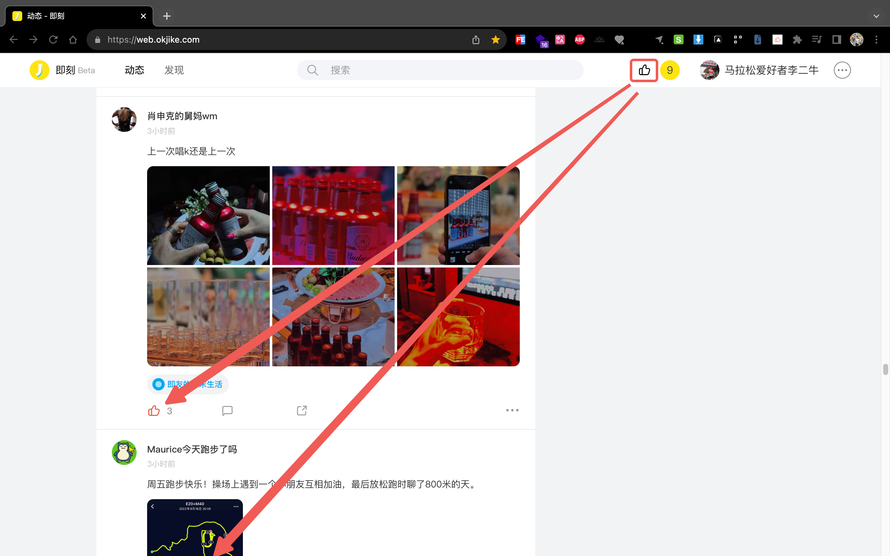

# 即刻一键点赞插件



[](https://chrome.google.com/webstore/detail/%E5%8D%B3%E5%88%BB%E4%B8%80%E9%94%AE%E7%82%B9%E8%B5%9E/llppkbngpglccdghbgojpocjbmdcpgfa) [](https://chrome.google.com/webstore/detail/%E5%8D%B3%E5%88%BB%E4%B8%80%E9%94%AE%E7%82%B9%E8%B5%9E/llppkbngpglccdghbgojpocjbmdcpgfa) [](https://chrome.google.com/webstore/detail/%E5%8D%B3%E5%88%BB%E4%B8%80%E9%94%AE%E7%82%B9%E8%B5%9E/llppkbngpglccdghbgojpocjbmdcpgfa)

## Build

```bash
make build.chrome
make build.firefox
```

Archives output dir is `build/artefacts`.
